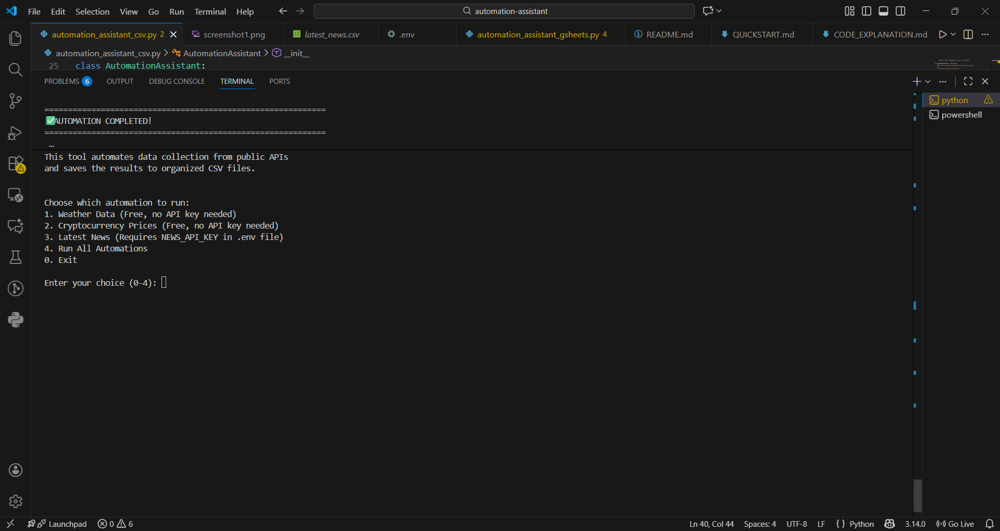
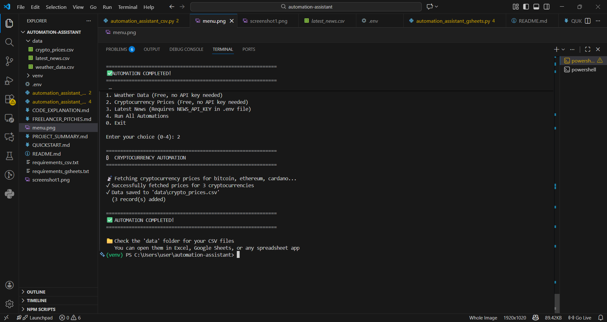
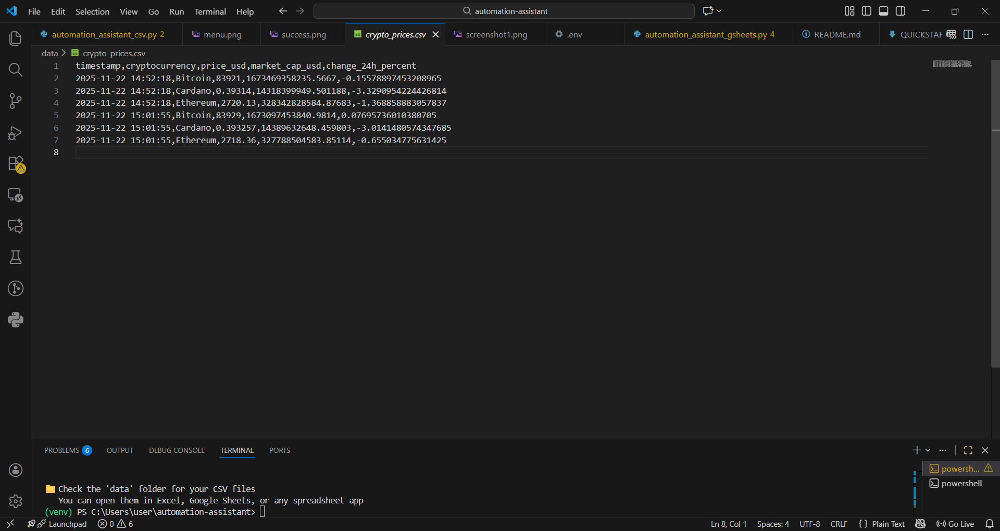

# 🤖 Automation Assistant

[](https://www.python.org/)
[](LICENSE)
[](https://github.com/BlessingOnyekanna/automation-assistant)

> A professional Python automation tool that collects data from multiple APIs and exports to CSV or Google Sheets.

[View Demo](#-screenshots) · [Report Bug](https://github.com/BlessingOnyekanna/automation-assistant/issues) · [Request Feature](https://github.com/BlessingOnyekanna/automation-assistant/issues)

---

## 📋 Project Overview

The Automation Assistant is a Python-based tool that automatically collects data from public APIs and saves it to either CSV files or Google Sheets. This project showcases real-world automation skills valuable for businesses that need regular data collection and reporting.

### ✨ Features

- **Multiple Data Sources**: Weather data, cryptocurrency prices, and latest news
- **Dual Output Options**: Save to CSV files OR Google Sheets
- **Professional Code**: Clean, well-commented, beginner-friendly structure
- **Error Handling**: Robust error handling and user-friendly messages
- **Automated Workflow**: Set it and forget it - runs automatically
- **No Complex Setup**: Two APIs work out-of-the-box (no API keys needed)

---

## 🎯 Three API Options

### 1. **Weather Data** (✅ No API Key Required)
- **API**: Open-Meteo (free, unlimited)
- **Data Collected**: Temperature, wind speed, weather conditions
- **Use Case**: Perfect for logistics, agriculture, event planning businesses

### 2. **Cryptocurrency Prices** (✅ No API Key Required)
- **API**: CoinGecko (free tier)
- **Data Collected**: Current prices, market cap, 24h price changes
- **Use Case**: Ideal for traders, financial blogs, investment tracking

### 3. **Latest News** (⚠️ Free API Key Required)
- **API**: NewsAPI.org (free tier: 100 requests/day)
- **Data Collected**: Headlines, sources, publication dates, article links
- **Use Case**: Great for media monitoring, competitive analysis, research

---
## 📸 Screenshots

### Interactive Menu


### Successful Data Collection


### Collected Data


---

## 🚀 Quick Start Guide

### Prerequisites

- Python 3.7 or higher installed
- pip (Python package manager)
- Internet connection

### Installation Steps

#### Step 1: Download the Project
```bash
# Create a project folder
mkdir automation-assistant
cd automation-assistant

# Copy the script files into this folder
```

#### Step 2: Install Required Libraries

**For CSV Version:**
```bash
pip install requests
```

**For Google Sheets Version:**
```bash
pip install requests google-auth google-auth-oauthlib google-auth-httplib2 google-api-python-client
```

#### Step 3: Choose Your Version

**Option A: CSV Version (Easier)**
```bash
python automation_assistant_csv.py
```

**Option B: Google Sheets Version (More Impressive)**
See "Google Sheets Setup" section below.

---

## 📊 CSV Version - Detailed Instructions

### Running the Script

1. **Open terminal/command prompt** in your project folder

2. **Run the script:**
   ```bash
   python automation_assistant_csv.py
   ```

3. **Choose an automation:**
   - Option 1: Weather Data (works immediately)
   - Option 2: Crypto Prices (works immediately)
   - Option 3: News (requires API key setup)
   - Option 4: Run all three

4. **Find your data:**
   - Look in the `data/` folder
   - Files: `weather_data.csv`, `crypto_prices.csv`, `latest_news.csv`
   - Open with Excel, Google Sheets, or any spreadsheet software

### Getting NewsAPI Key (Optional)

1. Visit: https://newsapi.org/register
2. Sign up for free (100 requests/day)
3. Copy your API key
4. Open `automation_assistant_csv.py` in a text editor
5. Find line with `api_key = "YOUR_API_KEY"`
6. Replace `YOUR_API_KEY` with your actual key
7. Save and run!

---

## 📈 Google Sheets Version - Setup Guide

### Step 1: Create Google Cloud Project

1. Go to: https://console.cloud.google.com/
2. Create a new project (e.g., "Automation Assistant")
3. Wait for project creation to complete

### Step 2: Enable Google Sheets API

1. In your project, go to "APIs & Services" > "Library"
2. Search for "Google Sheets API"
3. Click and enable it

### Step 3: Create Service Account

1. Go to "APIs & Services" > "Credentials"
2. Click "Create Credentials" > "Service Account"
3. Name it (e.g., "automation-bot")
4. Click "Create and Continue"
5. Skip optional steps, click "Done"

### Step 4: Download Credentials

1. Click on your service account email
2. Go to "Keys" tab
3. Click "Add Key" > "Create New Key"
4. Choose "JSON" format
5. Download and save as `credentials.json` in your project folder
6. **Important**: Note the service account email (looks like `name@project.iam.gserviceaccount.com`)

### Step 5: Create and Share Google Sheet

1. Go to: https://sheets.google.com/
2. Create a new blank spreadsheet
3. Name it (e.g., "Automation Data")
4. Click "Share" button
5. Add the service account email from Step 4
6. Give it "Editor" access
7. Copy the spreadsheet ID from the URL:
   - URL: `https://docs.google.com/spreadsheets/d/`**`1ABC...XYZ`**`/edit`
   - The ID is the part in bold

### Step 6: Configure the Script

1. Open `automation_assistant_gsheets.py` in a text editor
2. Find these lines:
   ```python
   CREDENTIALS_FILE = "credentials.json"
   SPREADSHEET_ID = "YOUR_SPREADSHEET_ID"
   ```
3. Replace `YOUR_SPREADSHEET_ID` with your actual ID from Step 5
4. Make sure `credentials.json` is in the same folder
5. Save the file

### Step 7: Run It!

```bash
python automation_assistant_gsheets.py
```

Your data will appear in real-time in Google Sheets! 🎉

---

## 🔍 How the Script Works - Step by Step

### Architecture Overview

```
User runs script
    ↓
Script connects to API (weather, crypto, or news)
    ↓
Fetches fresh data
    ↓
Formats data into structured format
    ↓
Saves to CSV file OR Google Sheets
    ↓
User can analyze, share, or visualize the data
```

### Detailed Breakdown

#### 1. **Initialization** (`__init__` method)
```python
def __init__(self, data_folder="data"):
    self.data_folder = data_folder
    if not os.path.exists(data_folder):
        os.makedirs(data_folder)
```
- Creates a folder to store CSV files
- Checks if folder exists, creates it if not
- Keeps everything organized

#### 2. **API Data Fetching** (e.g., `fetch_weather_data` method)
```python
def fetch_weather_data(self, city="London"):
    # Step 1: Geocode the city name to coordinates
    # Step 2: Request weather data from API
    # Step 3: Handle errors gracefully
    # Step 4: Format and return clean data
```

**What happens:**
- Converts city name to coordinates (latitude/longitude)
- Sends HTTP GET request to weather API
- Receives JSON response
- Extracts relevant fields (temperature, wind, etc.)
- Returns formatted dictionary

#### 3. **Data Saving** (`save_to_csv` or `save_to_sheet` method)
```python
def save_to_csv(self, data, filename):
    # Step 1: Check if data exists
    # Step 2: Convert to list format if needed
    # Step 3: Open/create CSV file
    # Step 4: Write headers (first time only)
    # Step 5: Append data rows
```

**What happens:**
- Opens CSV file (creates if new, appends if exists)
- Writes column headers on first run
- Adds new rows with timestamps
- Ensures data is properly formatted

#### 4. **Automation Runners** (e.g., `run_weather_automation`)
```python
def run_weather_automation(self, cities=None):
    # Step 1: Loop through list of cities
    # Step 2: Fetch data for each city
    # Step 3: Save each result
    # Step 4: Wait 1 second between requests (API etiquette)
```

**Why the 1-second delay?**
- Being polite to free APIs
- Prevents rate limiting
- Professional programming practice

---

## 🎨 Code Quality Highlights

### ✅ Professional Practices Used

1. **Clear Documentation**
   - Docstrings for every class and method
   - Comments explaining complex logic
   - Type hints in function signatures

2. **Error Handling**
   - Try-except blocks for API calls
   - Graceful failure messages
   - User-friendly error descriptions

3. **Modular Design**
   - Separate methods for each function
   - Reusable components
   - Easy to extend and modify

4. **User Experience**
   - Progress indicators (✓, ❌, 📡)
   - Interactive menu system
   - Clear success/failure messages

5. **Scalability**
   - Easy to add new APIs
   - Configurable parameters
   - Flexible data structures

---

## 💼 Freelancer Service Pitch

### Version 1: Professional & Results-Focused

**"I Will Automate Your Data Collection & Reporting Using Python"**

Stop wasting hours on repetitive data gathering! I'll build you a custom Python automation tool that:

✅ Automatically collects data from any API or website
✅ Saves to CSV, Excel, or Google Sheets - your choice
✅ Runs on schedule (hourly, daily, weekly)
✅ Delivers clean, organized, ready-to-analyze data
✅ Includes error handling and logging for reliability

**Perfect for:**
- Market research and competitor tracking
- Financial data monitoring (stocks, crypto, forex)
- Weather-dependent business planning
- Social media analytics
- News monitoring and media tracking

**What You Get:**
• Production-ready Python script with comments
• Setup instructions (so easy your team can run it)
• 30 days of support and bug fixes
• Optional: Automated scheduling setup

**Pricing:** Starting at $150 for basic automation | $300 for complex integrations

⚡ Fast turnaround: Most projects delivered within 3-5 days

---

### Version 2: Benefits-Driven

**"Turn Hours of Manual Work Into Minutes With Python Automation"**

Your time is valuable. Let me handle the boring, repetitive stuff.

I specialize in building Python automation tools that collect, organize, and deliver data exactly when and where you need it - without you lifting a finger.

**Recent Projects:**
🔹 E-commerce price tracker (saves client 10 hours/week)
🔹 Real estate market analyzer (tracks 500+ listings daily)
🔹 Social media sentiment dashboard (updates every hour)

**My Process:**
1. We discuss your needs (15-min call)
2. I build your custom solution
3. I deliver with instructions and video walkthrough
4. You save time and make better decisions

**Investment:** $150-$500 depending on complexity
**Timeline:** 3-7 days

💬 Message me with your data collection challenge - let's automate it!

---

### Version 3: Technical & Skill-Focused

**"Custom Python Data Automation: APIs → CSV/Google Sheets → Your Business Intelligence"**

**Tech Stack:**
- Python 3.x with requests, pandas, schedule libraries
- RESTful API integration (any public or private API)
- Google Sheets API, CSV/Excel output
- Error handling, logging, retry logic
- Optional: Database storage (SQLite, PostgreSQL)

**Services:**
✓ Web scraping (Beautiful Soup, Selenium)
✓ API integration (REST, GraphQL)
✓ Data transformation and cleaning
✓ Automated reporting pipelines
✓ Scheduled execution (cron, Task Scheduler, cloud)

**Delivery Includes:**
- Fully commented, PEP-8 compliant code
- requirements.txt for easy setup
- README with setup instructions
- Video demo of the automation in action

**Rates:**
Basic automation (1 API source): $150
Medium complexity (multiple sources/logic): $300
Advanced (databases, dashboards, APIs): $500+

📊 Portfolio: [Link to GitHub with examples]

---

## 🚀 Future Improvements & Add-Ons

### Beginner-Friendly Enhancements

1. **Automated Scheduling** ⏰
   - Make it run automatically every hour/day
   - Use Python's `schedule` library
   - **Skills Demonstrated:** Task automation, system scheduling
   
   ```python
   import schedule
   schedule.every().day.at("09:00").do(run_automation)
   ```

2. **Email Notifications** 📧
   - Send email when data is collected
   - Alert on errors or unusual data
   - **Skills Demonstrated:** SMTP integration, alerting systems
   
   ```python
   import smtplib
   # Send summary email with collected data
   ```

3. **Data Visualization Dashboard** 📊
   - Create charts from collected data
   - Use matplotlib or plotly
   - **Skills Demonstrated:** Data visualization, analysis
   
   ```python
   import matplotlib.pyplot as plt
   # Generate trend charts automatically
   ```

### Intermediate Enhancements

4. **Web Dashboard** 🌐
   - Build a simple Flask/Streamlit web app
   - View data in browser
   - **Skills Demonstrated:** Full-stack development, web frameworks
   - **Impressive Factor:** ⭐⭐⭐⭐⭐

5. **Database Integration** 🗄️
   - Store data in SQLite or PostgreSQL
   - Better for large datasets
   - **Skills Demonstrated:** Database design, SQL
   
   ```python
   import sqlite3
   # Store historical data efficiently
   ```

6. **Multi-Source Aggregation** 🔗
   - Combine data from multiple APIs
   - Create correlation reports
   - **Skills Demonstrated:** Data engineering, ETL pipelines

### Advanced Features

7. **Machine Learning Predictions** 🤖
   - Predict trends based on historical data
   - Use scikit-learn for simple models
   - **Skills Demonstrated:** ML, data science
   - **Impressive Factor:** ⭐⭐⭐⭐⭐

8. **Cloud Deployment** ☁️
   - Deploy to AWS Lambda or Google Cloud Functions
   - Run serverless, always available
   - **Skills Demonstrated:** Cloud architecture, DevOps
   - **Impressive Factor:** ⭐⭐⭐⭐⭐

---

## 📁 Project Structure

```
automation-assistant/
│
├── automation_assistant_csv.py      # CSV version (easier)
├── automation_assistant_gsheets.py  # Google Sheets version
├── credentials.json                 # Google service account (if using Sheets)
├── requirements.txt                 # Python dependencies
├── README.md                        # This file
│
└── data/                           # Created automatically
    ├── weather_data.csv
    ├── crypto_prices.csv
    └── latest_news.csv
```

---

## 🔧 Dependencies

### CSV Version
```
requests==2.31.0
```

### Google Sheets Version
```
requests==2.31.0
google-auth==2.23.0
google-auth-oauthlib==1.1.0
google-auth-httplib2==0.1.1
google-api-python-client==2.100.0
```

**Install all at once:**
```bash
pip install -r requirements.txt
```

---

## ❓ Troubleshooting

### Common Issues

**Problem:** "Module not found" error
**Solution:** Install required libraries with pip install

**Problem:** Google Sheets: "Authentication failed"
**Solution:** Check credentials.json is in the right folder and service account has Sheet access

**Problem:** NewsAPI not working
**Solution:** Verify your API key is correctly entered and not expired

**Problem:** "Rate limit exceeded"
**Solution:** Free APIs have limits. Wait a bit or upgrade to paid tier

---

## 🎓 What You Learn From This Project

- REST API integration and HTTP requests
- Data parsing (JSON to structured data)
- File I/O operations (reading/writing files)
- Google Cloud Platform and API authentication
- Error handling and user input validation
- Object-oriented programming in Python
- Professional code organization and documentation

---

## 📝 License

This project is open source and free to use for portfolio and learning purposes.
Feel free to modify, extend, and use it for client projects!

---

## 🤝 Contributing

Have ideas for improvements? Found a bug? Contributions are welcome!

---

## 👨‍💻 Author

**Your Name**
- Portfolio: [Your Website]
- GitHub: [Your GitHub]
- LinkedIn: [Your LinkedIn]
- Email: [Your Email]

---

## ⭐ Show Your Work

### For Portfolio Website:
- Screenshot of the script running
- Sample CSV files with real data
- Link to Google Sheets with live data
- Short video demo (30 seconds)

### For GitHub:
- Add detailed README (this file)
- Include sample output files
- Add a LICENSE file
- Use meaningful commit messages

### For Interviews:
**Be ready to explain:**
1. Why you chose these specific APIs
2. How you handle API rate limits
3. What error handling you implemented
4. How you'd scale this for production use
5. What security considerations you'd add

---

**Happy Automating! 🚀**
